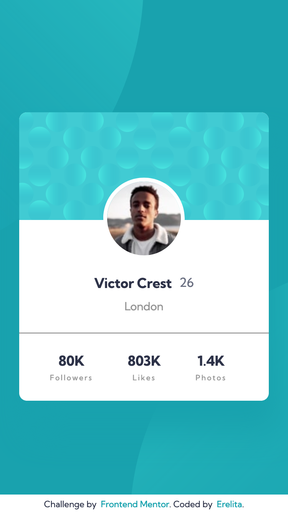
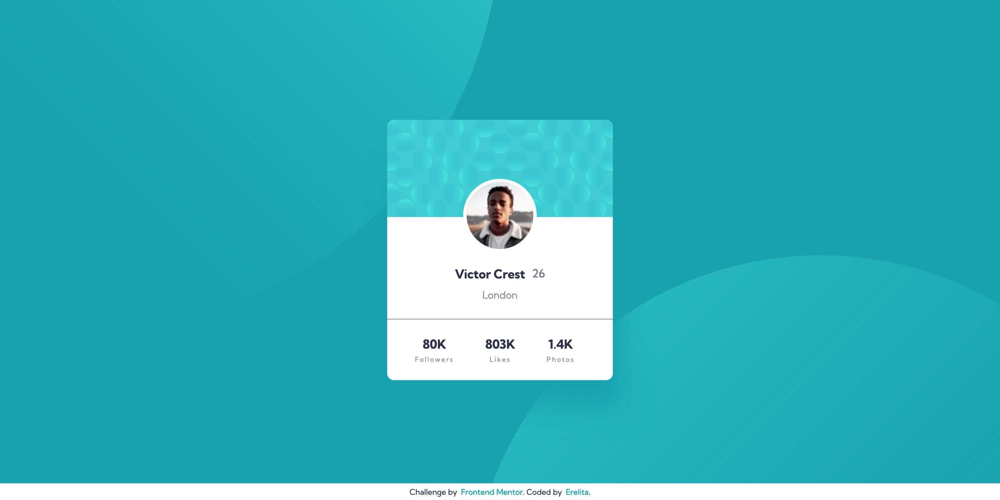

# Frontend Mentor - Profile card component solution

This is a solution to the [Profile card component challenge on Frontend Mentor](https://www.frontendmentor.io/challenges/profile-card-component-cfArpWshJ). Frontend Mentor challenges help you improve your coding skills by building realistic projects. 

## Table of contents

- [Overview](#overview)
  - [The challenge](#the-challenge)
  - [Screenshot](#screenshot)
  - [Links](#links)
- [My process](#my-process)
  - [Built with](#built-with)
  - [What I learned](#what-i-learned)
  - [Continued development](#continued-development)
  - [Useful resources](#useful-resources)
- [Author](#author)
- [Acknowledgments](#acknowledgments)

**Note: Delete this note and update the table of contents based on what sections you keep.**

## Overview

### The challenge

- Build out the project to the designs provided

### Screenshot

### Links

- Solution URL: [Github](https://github.com/erelita/profile-card-component.git)
- Live Site URL: [Netlify](https://profile-card-component-byer.netlify.app)

## My process

### Built with

- Semantic HTML5 markup
- CSS custom properties
- Flexbox
- Mobile-first workflow

### What I learned

Made a lot of 
s to make the layout work. Having containers/wrappers made it easier to use Flex CSS to customized each sections.

I had a little problem with the responsiveness of the two circles in the background. I tried adding @media queries for different min-width (768px, 1024px, 1440px), but there's always a breaking point while changing the screensize.

### Continued development

I'm still having problems with responsive layouts, so I think I'll focus more on that in the following projects/challenges.

## Author

- Github - [Erelita](https://github.com/erelita)
- Frontend Mentor - [@erelita](https://www.frontendmentor.io/profile/erelita)